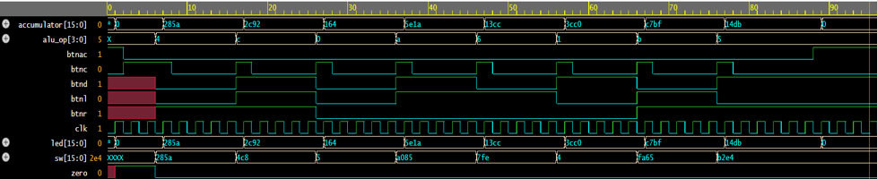
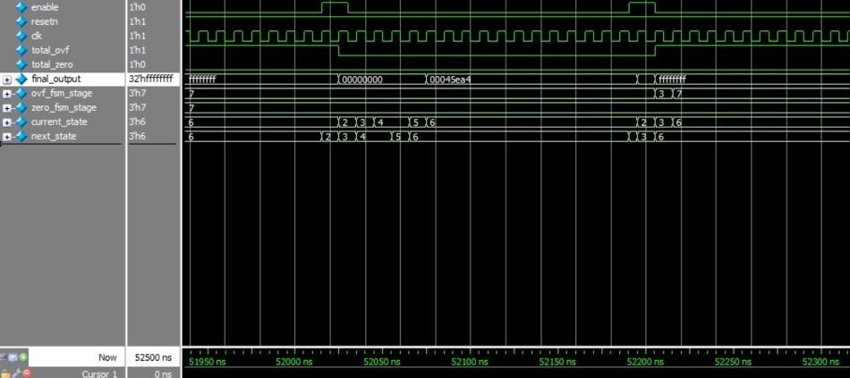

# Neural Network

## Waveforms from the functionality of the implemented `Calculator`:

## Waveforms from the functionality of the implemented `Neural Network`:

## `FSM` representation of the implemented `Neural Network`:

